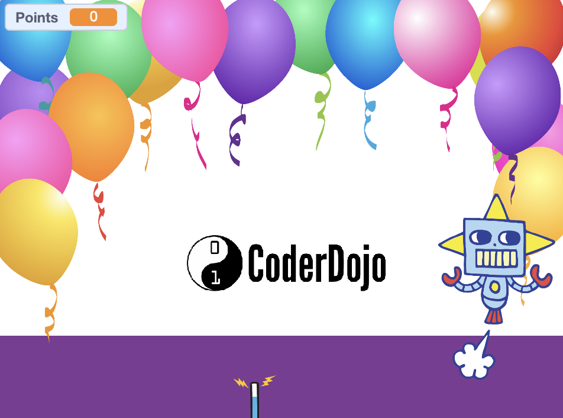
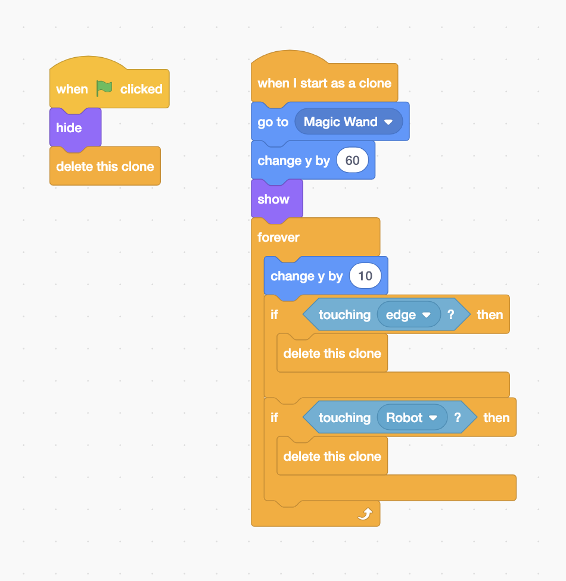
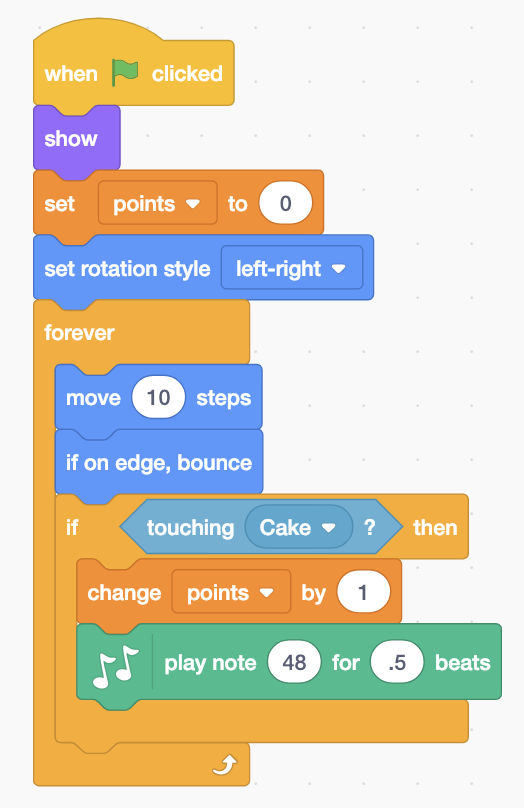
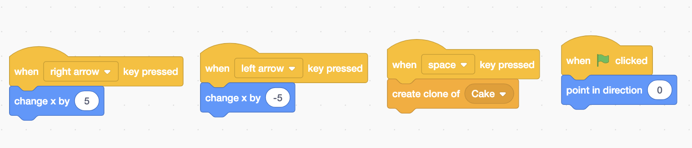
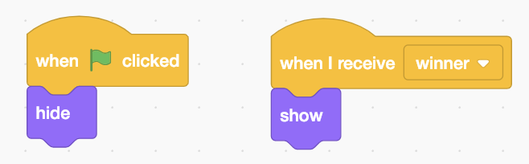
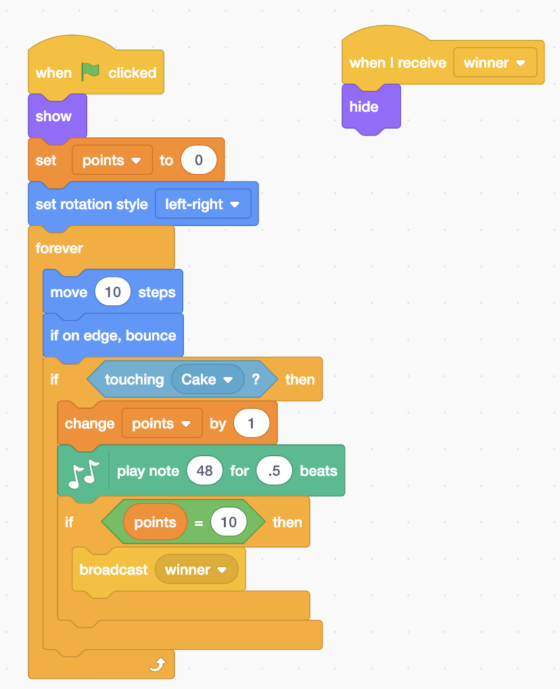
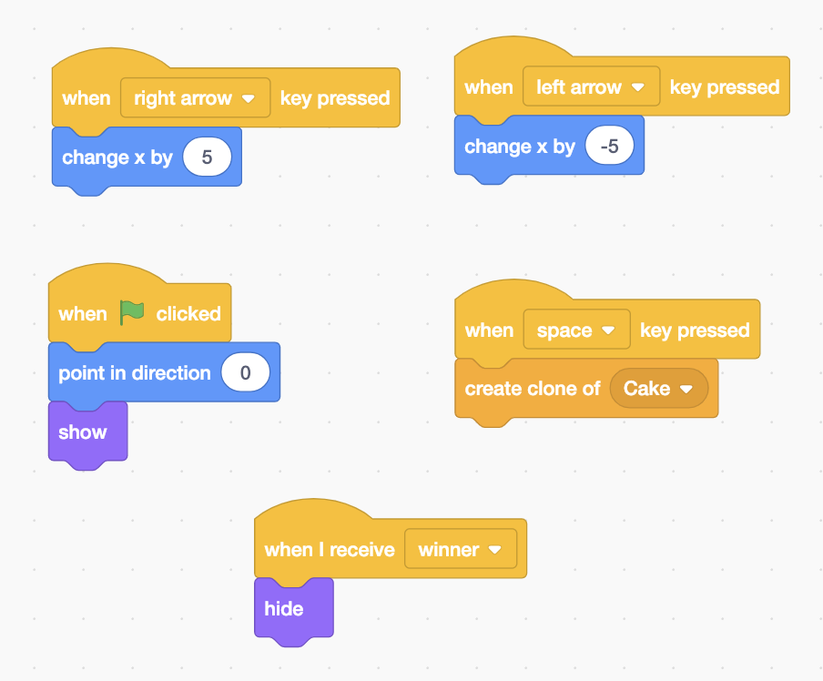

# Birthday Scratch

## Normal

Since we're celebrating a birthday, let’s throw birthday cakes at a robot! You’re going to need to have Scratch 3, or use it online at scratch.mit.edu

----

### One I made earlier

You can see a version of this game at [dojo.soy/birthdayscratch](http://dojo.soy/birthdayscratch) that you can play with to see how it works.

----

You can find everything except the CoderDojo logo in the sprite library in Scratch, and the logo is at [dojo.soy/birthdaylogo](http://dojo.soy/birthdaylogo) for you. You will need to add the music extension before you can play notes though. Here’s the code for your sprites:

### Cake code

### Robot code

### Wand code

## Hard

Now you can add some trickier stuff: Checking for a particular score and telling the player they’ve won when they reach it.

You’ll need to create a new ‘You Win!’ sprite using the editing tools in Scratch.

Then you need to add and change some bits of your code:

### You win code

### Robot code

### Wand code

## Ultra

Change the game around so you score points when you don’t hit the robot. Or make it play ‘Happy Birthday’ like my demo. You decide!